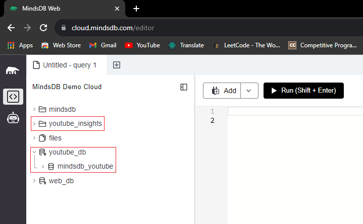

### Step 4: Install the MindsDB Python SDK and import it

- Now that you have a basic Flask app, you can install the MindsDB Python SDK. First, install the MindsDB Python SDK:

  ```ps
  pip install mindsdb_sdk
  ```

- Then import the MindsDB SDK in `app.py`:

  ```py
  ...
  import mindsdb_sdk
  ...
  ```

### Step 5: Create a MindsDB project

- To create a mindsdb project in python we have first make a connection to the mindsdb server.

  ```py
  ...
  load_dotenv()
  # Check if the environment variables are set
  if os.environ.get('MINDSDB_EMAIL') is None:
      raise Exception('Please set the MINDSDB_EMAIL environment variable')
  if os.environ.get('MINDSDB_PASSWORD') is None:
      raise Exception(
          'Please set the MINDSDB_PASSWORD environment variable')

  # Connect to MindsDB Cloud server
  try:
      server = mindsdb_sdk.connect(login=os.environ.get(
          'MINDSDB_EMAIL'), password=os.environ.get('MINDSDB_PASSWORD'))
      print("Connected to MindsDB Cloud server")
  except:
      raise Exception("Check your internet connection or mindsdb credentials")
  ...
  ```

  In this code snippet we are checking if the environment variables are set and then we are connecting to the mindsdb server using the `connect` method. You can read more about the `connect` method [here](https://docs.mindsdb.com/sdk_python/connect).

- Now we are ready to create a mindsdb project. To create a mindsdb project we have to use the `create_project` method. You can read more about the `create_project` method [here](https://docs.mindsdb.com/sdk_python/create_project).

  ```py
  ...
  # Create project if not exists
  try:
      project = server.get_project('youtube_insights')
      print("Project already exists")
  except:
      project = server.create_project('youtube_insights')
      print("Project created")
  ...
  ```

  In this code snippet we are checking if the project exists and if it doesn't exist we are creating a new project called `youtube_insights`.

### Step 6: Integrate Data Sources

- Now that we have a mindsdb project, we can integrate a mindsdb data source. To integrate a mindsdb data source we have to use the `create_database` method. You can read more about the `create_database` method [here](https://docs.mindsdb.com/sdk_python/create_database).

  ```py
  ...
  # Add data sources if not exists
  try:
      # Check if the environment variables are set
      if os.environ.get('YOUTUBE_API_KEY') is None:
          raise Exception(
              'Please set the YOUTUBE_API_KEY environment variable')
      # Create the database
      mindsdb_youtube = server.create_database(name='mindsdb_youtube', engine='youtube', connection_args={
          'youtube_api_token': os.environ.get('YOUTUBE_API_KEY')})
      print("Database created")
  except:
      mindsdb_youtube = server.get_database('mindsdb_youtube')
      print("Database already exists")
  ...
  ```
  In this code snippet we are checking if the data source exists and if it doesn't exist we are creating a new data source called `mindsdb_youtube` using the `create_database` method. We are using the `youtube` engine to create the data source. We are using the `YOUTUBE_API_KEY` environment variable as the `youtube_api_token` connection argument.
  
  Note : Now you can run the following program to create your mindsdb project, data source into the [MindsDB cloud server](https://cloud.mindsdb.com/).

  

# Congratulations!🎊 You have successfully created a MindsDB project and data source using the MindsDB Python SDK.

[<<Previous](./index.md) [Next>>](./page2.md)
