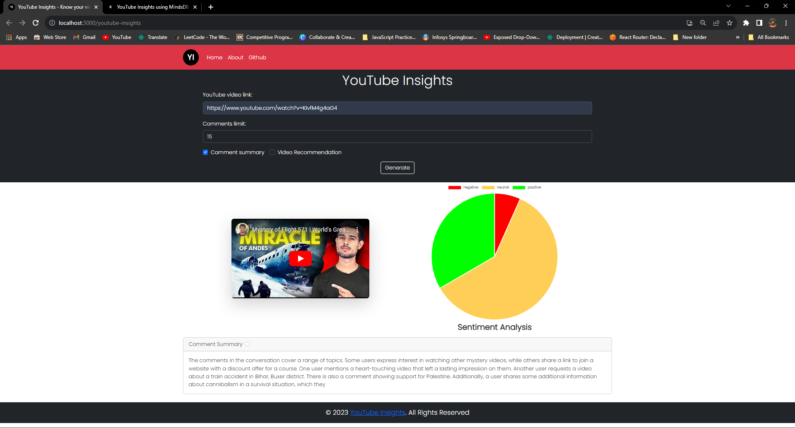

## Step 9: YouTube comment summarization

We are continuing the definition of the `get_youtube_insights` function from the previous step.

1. **Summarize Comments**:

  ```py
  # gather all comment
  merged_comments = ' '.join(sentiment_result['comment'].tolist())
  # predict summarized comments
  summarizer_result = text_summarization_model.predict(data={'comments': merged_comments})
  # store the summary in response dictionary
  response["comment_summary"] = str(summarizer_result['comment_summary'][0])
  ```

   In this code we are using the `predict` method to predict the `comment_summary` column of the `text_summarization_model` model. We are using the `merged_comments` variable as the input data. We are using the `comment_summary` column as the target column. After getting the result we are storing the result in the `comment_summary` key of the `response` dictionary.

9. **Response Return**:
   ```py
   return jsonify(response)
   ```
   This line returns the API response in JSON format.

Note: Now you can run the flask application using the following command:

```sh
python app.py
```
## Step 10: Making request to our Flask app 
After successfully running the previous command you can access the API endpoint at [http://localhost:5000/api/youtube?youtube_video_id=KIvfM4g4aG4&limit=15](http://localhost:5000/api/youtube?youtube_video_id=KIvfM4g4aG4&limit=15)

You will get the following response:

```json
{
  "comment_summary": "The comments in the conversation cover a range of topics. One user asks about other mystery videos they would like to see, while another user shares a link to join a website with a discount offer. Another user requests a video about a train accident in Bihar Buxer district, expressing their sadness. There is also a comment expressing support for Palestine. The conversation then shifts to discussing a story about survivors resorting to cannibalism, with one trekker choosing to trek instead of eating his family members.",
  "sentiments": {
    "negative": 1,
    "neutral": 11,
    "positive": 3
  }
}
```

## Conclusion:

In this tutorial we have learned how to create a MindsDB project, data source and model. We have also learned how to use the MindsDB SDK to make predictions. We have also learned how to create a Flask application and use the MindsDB SDK to make predictions in the Flask application.

## What's next?

- You can fit this data into any kind of front end application (web/android) through api calls. 
Example:


[<<Previous](./page2.md)
